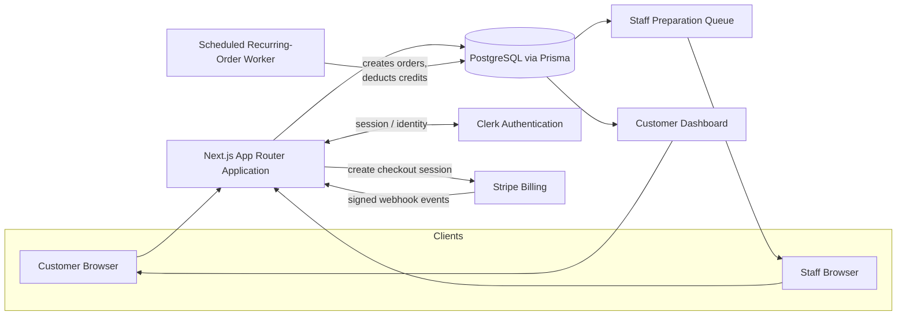

# 03 — Architecture Overview

## Initial system architecture

- Next.js App Router application.
- TypeScript.
- PostgreSQL relational database.
- Prisma ORM.
- Clerk authentication.
- Stripe Billing with verified webhooks.
- Scheduled recurring-order worker.
- Azure deployment later.
- Docker and Terraform later.

This is intentionally a single deployable application plus one scheduled
worker — no microservices, no message broker, no separate API gateway. The
MVP's concurrency and data volume (see
[02-system-assumptions.md](02-system-assumptions.md)) do not justify that
complexity, and it would slow down reaching the success criteria in
[01-product-goal-and-scope.md](01-product-goal-and-scope.md).

## System diagram



Notes on the diagram:

- Clerk owns identity; the Next.js app never handles raw credentials.
- Stripe Checkout is the only path that touches payment instruments; Stripe
  webhooks are the only path that confirms payment state back into BrewMind,
  and every webhook is signature-verified before it is trusted.
- The scheduled worker is decoupled from request/response traffic — it runs
  on a timer, reads active schedules, and writes orders/credit deductions
  directly to PostgreSQL using idempotency keys so a retry or duplicate run
  cannot create duplicate orders.
- The customer dashboard and staff queue are both read views over the same
  `orders` data, filtered by role and ownership.

## Database decision: PostgreSQL

BrewMind's core data — users, subscriptions, plans, credits, products,
drinks, schedules, orders, locations, and staff roles — is relational and
transactional:

- Orders reference a customer, a plan, a saved drink, and a schedule.
- Credit deductions must be atomic with order creation (an order should never
  exist without a corresponding credit deduction, and vice versa).
- Pickup-window capacity must be checked and reserved without race
  conditions across concurrent requests.

PostgreSQL's transactional guarantees and foreign-key constraints are a
direct fit for these requirements, and Prisma gives typed, migration-tracked
access to that schema from the Next.js app and the scheduled worker.

**Payment and credit operations require consistency.** Every write that
touches a subscription credit or an order created from a Stripe event happens
inside a database transaction with a unique/idempotency constraint (see
[02-system-assumptions.md](02-system-assumptions.md), Data principles), so a
retried webhook or a re-run of the recurring-order worker cannot double-charge
a credit or create a duplicate order.

## API decision: REST-style Next.js route handlers

The MVP uses REST-style Next.js route handlers rather than GraphQL or a
separate API service. The resource set is small and well-understood, the
client is a single first-party app (no third-party API consumers yet), and
route handlers keep the API co-located with the app that serves it.

### Planned resources

- `/api/plans`
- `/api/products`
- `/api/saved-drinks`
- `/api/schedules`
- `/api/orders`
- `/api/subscriptions`
- `/api/staff/orders`
- `/api/webhooks/stripe`
- `/api/health/live`
- `/api/health/ready`

### Request and response shapes

- All request and response bodies are JSON.
- Successful responses return the resource (or a page of resources) directly
  under a `data` key: `{ "data": { ... } }` or `{ "data": [ ... ], "meta": { ... } }`.
- Error responses share one shape across every endpoint:
  ```json
  {
    "error": {
      "code": "STABLE_MACHINE_READABLE_CODE",
      "message": "Human-readable description",
      "details": { }
    }
  }
  ```

### Server-side validation

- Every route handler validates its input against a schema before touching
  the database or Stripe.
- Validation failures return `400` with a stable error `code` and, where
  useful, field-level `details`.
- Validation is the responsibility of the API layer, not the client — the
  client's own validation is a UX convenience only.

### Stable error codes

Error codes are stable strings (not HTTP status codes) so clients can branch
on them without parsing messages, e.g. `PLAN_NOT_FOUND`,
`SCHEDULE_CONFLICT`, `PICKUP_WINDOW_FULL`, `SAVED_DRINK_UNAVAILABLE`,
`SUBSCRIPTION_INACTIVE`, `INSUFFICIENT_CREDITS`, `UNAUTHORIZED`,
`FORBIDDEN`, `WEBHOOK_SIGNATURE_INVALID`. The full set is finalized during
Phase 2 implementation of each resource, not invented speculatively here.

### HTTP status codes

Standard, meaningful status codes are used consistently: `200`/`201` for
success, `400` for validation errors, `401` for missing/invalid
authentication, `403` for authorization failures (e.g. a customer requesting
another customer's order), `404` for missing resources, `409` for conflicts
(e.g. a full pickup window or a duplicate webhook), and `429` for rate-limited
requests.

### Pagination and filtering

Order-list endpoints (`/api/orders`, `/api/staff/orders`) support:

- Cursor-based pagination (`?cursor=...&limit=...`), returned alongside a
  `meta.nextCursor` value.
- Filtering by status (e.g. `upcoming`, `completed`, `skipped`) and by date
  range.

### Rate limiting

Sensitive endpoints — authentication-adjacent routes, `/api/webhooks/stripe`,
and any endpoint that mutates a subscription or schedule — are rate-limited
per user/IP to reduce abuse and accidental retry storms.

### API versioning

No API versioning scheme is introduced until a real compatibility need
exists (e.g. a public third-party integration). Introducing versioning before
there is a second consumer would be speculative complexity with no present
payoff.
